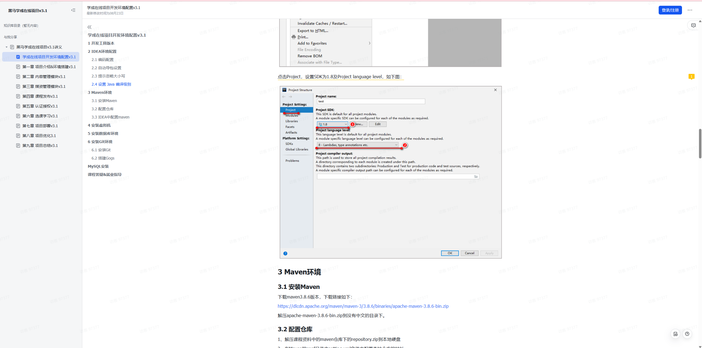

java语言实现的设计模式 包括设计原则 23种模式 自定义spring

以下几个模式是我认为比较重要的
建造者模式
工厂模式
单例模式
状态模式
责任链
代理模式 装饰者
发布订阅模式
解释器

自定义spring部分较难
初始化用xmlBeanDefinitionReader读取配置文件存入BeanDefinitionMap
singletonObjects存实例对象
getBean时在singletonObjects存实例对象里找，如果没有就用反射实例化对象

使用时创建，不能解决循环依赖

